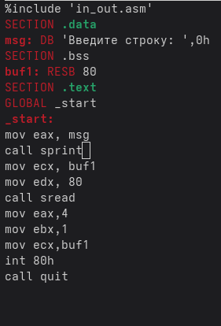

# Отчет по лабораторной работе №5

*Основы работы с Midnight Commander (mc). Структура программы на языке ассемблера NASM.
> лиссом байем 
> 
## 1 Цель работы

Приобретение практических навыков работы в Midnight Commander. Освоение инструкций языка ассемблера mov и int.
> ## 2 Теоретическое введение
> Midnight Commander (mc) — это файловый менеджер, который позволяет просматривать структуру каталогов и выполнять основные операции с файловой системой. Он делает работу с файлами более удобной и наглядной.
> Программа на языке ассемблера NASM, как правило, состоит из трёх секций: секция кода программы (SECTION_text), секция инициированных (известных во время компиляции) данных (SECTION.data) и секция нениициализированных данных (тех, под которые во время компиляции только отводится память, а значение присваивается в ходе выполнения программы) (SECTION.bss).
> Директивы используют mov_dst,src

Здесь операнд dst — приёмник, а src — источник. В качестве операнда могут выступать регистры (register), ячейки памяти (memory) и непосредственные значения (const).

Инструкция языка ассемблера intпредназначена для вызова прерывания с указанным номером
*int n*
> 
## 3 Выполнение лабораторной работы

### 3.1 Основы работы с mc
> 
Открываю Midnight Commander, введя в терминал mc (рис. 3.1).

Перехожу в каталог ~/work/study/2025-2026/arch-pc, используя файловый менеджер mc (рис. 3.2)

С помощью функциональной клавиши F7 создаю каталог lab05 и перехожу в него (рис. 3.3).
> 

В строке ввода прописываю команду touch lab5-1.asm, чтобы создать файл, в котором буду работать (рис. 3.4).

### 3.2 Структура программы на языке ассемблера NASM

С помощью функциональной клавиши F4 открываю созданный файл для редактирования в редакторе (рис. 3.5).

Ввожу в файл код программы для запроса строки у пользователя (рис. 3.6). Далее выхожу из файла (Ctrl+X), сохраняя изменения (Y, Enter).С помощью функциональной клавиши F3 открываю файл для просмотра, чтобы проверить, содержит ли файл текст программы

> 
Транслирую текст программы файла в объектный файл командой nasm -f elf lab5-1.asm. Создался объектный файл lab5-1.o. Выполняю компоновку объектного файла с помощью команды ld -m elf_1386 -o lab5-1 lab5-1.o (рис. 3.7). Создался исполняемый файл lab5-1.

Запускаю исполняемый файл. Программа выводит строку "Введите строку:" и ждет ввода с клавиатуры, я ввожу свои ФИО, на этом программа заканчивает свою работу (рис. 3.8).

> ### 3.3 Подключение внешнего файла

Скачиваю файл in_out.asm со страницы курса в ТУИС. Он сохранился в каталог "Загрузки" (рис. 3.9).

С помощью функциональной клавиши F5 копирую файл in_out.asm из каталога Загрузки в созданный каталог lab05 (рис. 3.10).

С помощью функциональной клавиши F5 копирую файл lab5-1 в тот же каталог, но с другим именем, для этого в появившемся окне mc прописываю имя для копии файла (рис. 3.11).

> Изменяю содержимое файла lab5-2.asm во встроенном редакторе (рис. 3.12), чтобы в программе использовались подпрограммы из внешнего файла in_out.asm.

Транслирую текст программы файла в объектный файл командой nasm -f elf lab5-2.asm. Создался объектный файл lab5-2.o. Выполняю компоновку объектного файла с помощью команды ld -m elf_1386 -o lab5-2 lab5-2.o Создался исполняемый файл lab5-2. Запускаю исполняемый файл (рис. 3.13).

Открываю файл lab5-2.asm для редактирования в nano функциональной клавишей F4. Изменяю в нем подпрограмму sprintLF на sprint. Сохраняю изменения и открываю файл для просмотра, чтобы проверить сохранение действий (рис. 3.14).

Снова транслирую файл, выполняю компоновку созданного объектного файла, запускаю новый исполняемый файл (рис. 3.15).

> Разница между первым исполняемым файлом и вторым в том, что запуск первого запрашивает ввод с новой строки, а программа, которая исполняется при запуске второго, запрашивает ввод без переноса на новую строку, потому что в этом заключается различие между подпрограммами sprintLF и sprint.

### 3.4 Выполнение заданий для самостоятельной работы

1. Создаю копию файла lab5-1.asm с именем lab5-1-1.asm с помощью функциональной клавиши F5 (рис. 3.16).

С помощью функциональной клавиши F4 открываю созданный файл для редактирования. Изменяю программу так, чтобы кроме вывода приглашения и запроса ввода, она выводила вводимую пользователем строку (рис. 3.17).
> 
> 

2. Создаю объектный файл lab5-1-1.o, отдаю его на обработку компоновщику, получаю исполняемый файл lab5-1-1, запускаю полученный исполняемый файл. Программа запрашивает ввод, ввожу свои ФИО, далее программа выводит введенные мною данные (рис. 4.18).

Код программы из пункта 1:

*SECTION .data ;* Секция инициированных данных

msg: DB 'Введите строку:',10

msgLen: EQU $-msg ; Длина переменной 'msg'
*SECTION .bss ;* Секция не инициированных данных

buf1: RESB 80 ; Буфер размером 80 байт

*SECTION .text ;* Код программы

*GLOBAL_start ;* Начало программы

start: ; Точка входа в программу
*mov eax,4 ;* Системный вызов для записи (sys_write)

*mov ebx,1 ;* Описатель файла 1 - стандартный вывод

*mov ecx,msg ;* Адрес строки 'msg' в 'есх'

*mov edx,msgLen ;* Размер строки 'msg' в 'edх'

*int 80h ;* Вызов ядра

*mov eax, 3 ;* Системный вызов для чтения (sys_read)

*mov ebx, 0 ;* Дескриптор файла 0 - стандартный ввод

*mov ecx, buf1 ;* Адрес буфера под ввод uniqueую строку

*mov edx, 80 ;* Длина вводимой строки
*int 80h ;* Вызов ядра

*mov eax,4 ;* Системный вызов для записи (sys_write)

*mov ebx,1 ;* Описатель файла '1' - стандартный вывод

*mov ecx,buf1 ;* Адрес строки buff1 в есх

*mov edx,buf1 ;* Размер строки buff1

*int 80h ;* Вызов ядра

*mov eax,1 ;* Системный вызов для выхода (sys_exit)

*mov ebx,0 ;* Выход с кодом возврата 0 (без ошибок)

*int 80h ;* Вызов ядра

3. Создаю копию файла lab5-2.asm с именем lab5-2-1.asm с помощью функциональной клавиши F5 (рис. 3.19).

С помощью функциональной клавиши F4 открываю созданный файл для редактирования. Изменяю программу так, чтобы кроме вывода приглашения и запроса ввода, она выводила вводимую пользователем строку (рис. 3.20).

4. Создаю объектный файл lab5-2-1.o, отдаю его на обработку компоновщику, получаю исполняемый файл lab5-2-1, запускаю полученный исполняемый файл. Программа запрашивает ввод без переноса на новую строку, ввожу свои ФИО, далее программа выводит введенные мною данные (рис. 3.21).

Код программы из пункта 3:

%include 'in_out.asm'

*SECTION .data* ; Секция инициированных данных msg: DB 'Введите строку: ',0h ; сообщение

*SECTION .bss* ; Секция не инициированных данных buf1: RESB 80 ; Буфер размером 80 байт

*SECTION .text* ; Код программы

*GLOBAL .start* ; Начало программы _start: ; Точка входа в программу

*mov eax, msg* ; запись адреса выводимого сообщения в EAX

*call sprint* ; вызов подпрограммы печати сообщения

*mov ecx, buf1* ; запись адреса переменной в EAX

*mov edx, 80* ; запись длины вводимого сообщения в EBX

*call sread* ; вызов подпрограммы ввода сообщения

*mov eax,4* ; Системный вызов для записи (sys_write)
*mov ebx,1* ; Описатель файла '1' - стандартный вывод

*mov ecx,buf1* ; Адрес строки buf1 в еса

*int 80h* ; Вызов ядра

*call quit* ; вызов подпрограммы завершения
## 4 Выводы

При выполнении данной лабораторной работы я приобрела практические навыки работы в Midnight Commander, а также освоила инструкции языка ассемблера mov и int.

## 5  Список литературы

1. Лабораторная работа №5
